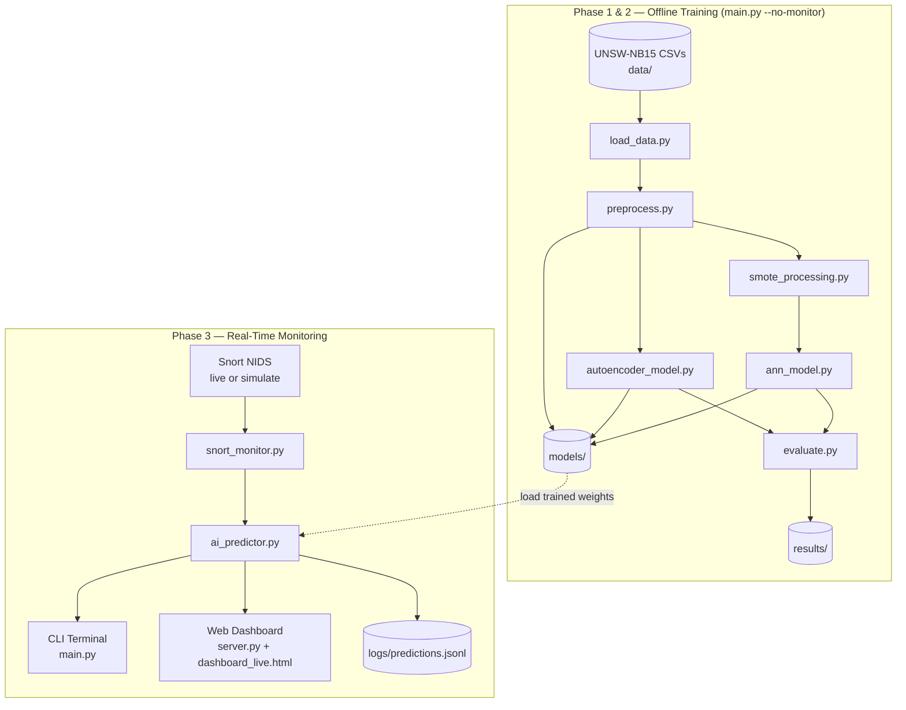
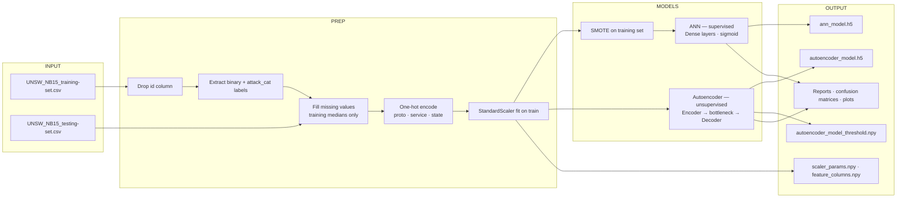
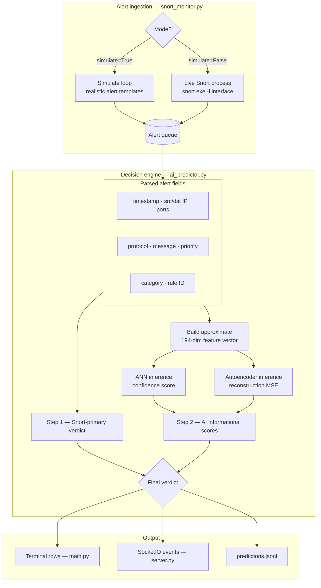
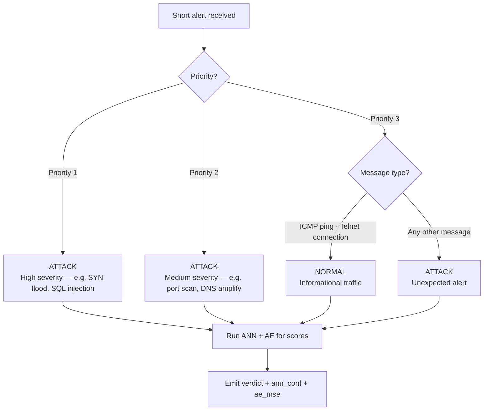
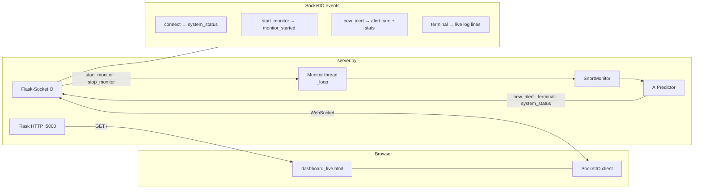
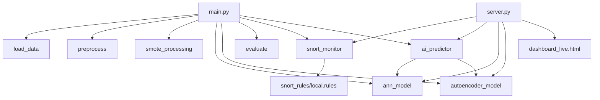

# AI-Based Intrusion Detection System (IDS)

A hybrid network intrusion detection system that combines a supervised **Artificial Neural Network (ANN)** with an unsupervised **Autoencoder** for real-time threat detection. Models are trained on the [UNSW-NB15](https://research.unsw.edu.au/projects/unsw-nb15-dataset) dataset with SMOTE class balancing, then deployed against live or simulated Snort alerts.

## Features

- **Dual-model detection** — ANN classifies known attack patterns; Autoencoder flags anomalous traffic via reconstruction error
- **SMOTE balancing** — Handles class imbalance in training data
- **Real-time monitoring** — Snort integration with simulated or live network interface modes
- **Live web dashboard** — Flask + SocketIO dashboard with attack statistics and alert stream
- **Evaluation reports** — Confusion matrices, learning curves, and model comparison plots saved to `results/`

## Architecture

The system has two main phases: an **offline training pipeline** (batch) and an **online monitoring pipeline** (real-time). Both share the same saved models in `models/`.

### High-level system overview



### Training pipeline (detailed)



| Step | Module | Output |
|---|---|---|
| Load | `load_data.py` | Raw train/test DataFrames |
| Preprocess | `preprocess.py` | Scaled feature matrices, labels |
| Balance | `smote_processing.py` | SMOTE-resampled training set (ANN only) |
| Train ANN | `ann_model.py` | Binary attack classifier |
| Train AE | `autoencoder_model.py` | Anomaly detector + MSE threshold |
| Evaluate | `evaluate.py` | Metrics, reports, comparison plots |

### Real-time detection pipeline (detailed)



### Detection decision logic

The **authoritative verdict** comes from Snort rule priority and message. ANN and Autoencoder scores are computed and shown on the dashboard as **informational confidence indicators** — they do not override the Snort verdict.



| Priority | Examples | Verdict |
|---|---|---|
| 1 | SYN flood, SQL injection, brute force | Always **ATTACK** |
| 2 | Port scan, DNS amplification, XSS | Always **ATTACK** |
| 3 | ICMP ping, Telnet connection | **NORMAL** |
| 3 | Other messages | **ATTACK** |

### Web dashboard architecture



| Component | Role |
|---|---|
| `Flask` | Serves dashboard HTML at `/` and status JSON at `/status` |
| `Flask-SocketIO` | Bi-directional real-time events between browser and server |
| `SnortMonitor` | Background thread feeding alerts into the prediction loop |
| `AIPredictor` | Loads saved models and produces verdict + scores per alert |
| `dashboard_live.html` | Live alert feed, attack counters, and terminal log |

### Component interaction map



## Project structure

```
ai_based_ids_system/
├── main.py                 # Train, evaluate, and run CLI monitor
├── server.py               # Web dashboard server
├── dashboard_live.html     # Live dashboard UI
├── requirements.txt        # Python dependencies
├── DATASET.md              # Dataset download and citation info
├── src/
│   ├── load_data.py        # Load UNSW-NB15 CSVs
│   ├── preprocess.py       # Feature scaling and encoding
│   ├── smote_processing.py # SMOTE oversampling
│   ├── ann_model.py        # ANN training and inference
│   ├── autoencoder_model.py# Autoencoder training and inference
│   ├── ai_predictor.py     # Combined ANN + AE predictor
│   ├── evaluate.py         # Metrics, reports, and plots
│   └── snort_monitor.py    # Snort alert ingestion
├── data/                   # Place dataset CSVs here (not in repo)
├── models/                 # Saved models after training
├── results/                # Evaluation reports and plots
├── logs/                   # Runtime prediction logs
└── snort_rules/            # Snort rule files
```

## Prerequisites

- Python 3.10+
- pip

Optional for live monitoring:

- Snort installed and configured
- Administrator privileges (for live network capture)

## Setup

### 1. Clone the repository

```bash
git clone <your-repo-url>
cd ai_based_ids_system
```

### 2. Create a virtual environment

```bash
python -m venv ids
ids\Scripts\activate        # Windows
# source ids/bin/activate   # Linux/macOS
```

### 3. Install dependencies

```bash
pip install -r requirements.txt
```

### 4. Download the dataset

The UNSW-NB15 CSV files are not included in this repo. See [DATASET.md](DATASET.md) for download links, licensing terms, and citation requirements.

Place these files in `data/`:

- `UNSW_NB15_training-set.csv`
- `UNSW_NB15_testing-set.csv`

## Usage

### Train and evaluate

```bash
python main.py --no-monitor
```

This runs the full pipeline: load data → preprocess → SMOTE → train ANN and Autoencoder → evaluate → save models to `models/` and reports to `results/`.

### Train and monitor (CLI)

```bash
python main.py                  # simulated Snort alerts
python main.py --live --iface 5 # live Snort on network interface 5
```

### Monitor only (models already trained)

```bash
python main.py --skip-training
```

### Web dashboard

```bash
python server.py                # opens http://127.0.0.1:5000
python server.py --live --iface 5
python server.py --port 8080 --no-open
```

Train models first if they do not exist:

```bash
python main.py --no-monitor
python server.py
```

## How detection works

1. **Snort** raises an alert (live capture or simulation).
2. **`snort_monitor.py`** parses it into structured fields (IP, port, protocol, priority, message).
3. **`ai_predictor.py`** applies Snort-primary rules to set the final verdict.
4. ANN and Autoencoder run in parallel to produce **confidence** and **MSE** scores for the dashboard.
5. Results go to the CLI, web dashboard, and `logs/predictions.jsonl`.

| Component | Role in detection |
|---|---|
| Snort rules | **Primary** — priority + message determine ATTACK / NORMAL |
| ANN | **Secondary** — confidence score (informational) |
| Autoencoder | **Secondary** — reconstruction MSE (informational) |

| Model | Trained on | Used for |
|---|---|---|
| ANN | SMOTE-balanced training data | Confidence display on dashboard |
| Autoencoder | Normal traffic only | MSE display on dashboard |

See the [Detection decision logic](#detection-decision-logic) diagram above for the full verdict flow.

## Output

After training, check:

| Location | Contents |
|---|---|
| `models/` | `ann_model.h5`, `autoencoder_model.h5`, scaler and feature files |
| `results/` | Text reports, confusion matrices, learning curves |
| `logs/predictions.jsonl` | Real-time prediction log (created during monitoring) |

## License

**Code in this repository:** Your choice — add a `LICENSE` file if you plan to open-source it.

**UNSW-NB15 dataset:** Academic use is permitted by the original authors. Commercial use requires their permission. See [DATASET.md](DATASET.md) for full terms and required citations.
